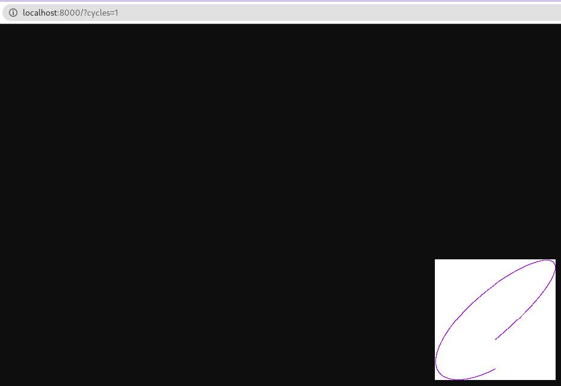
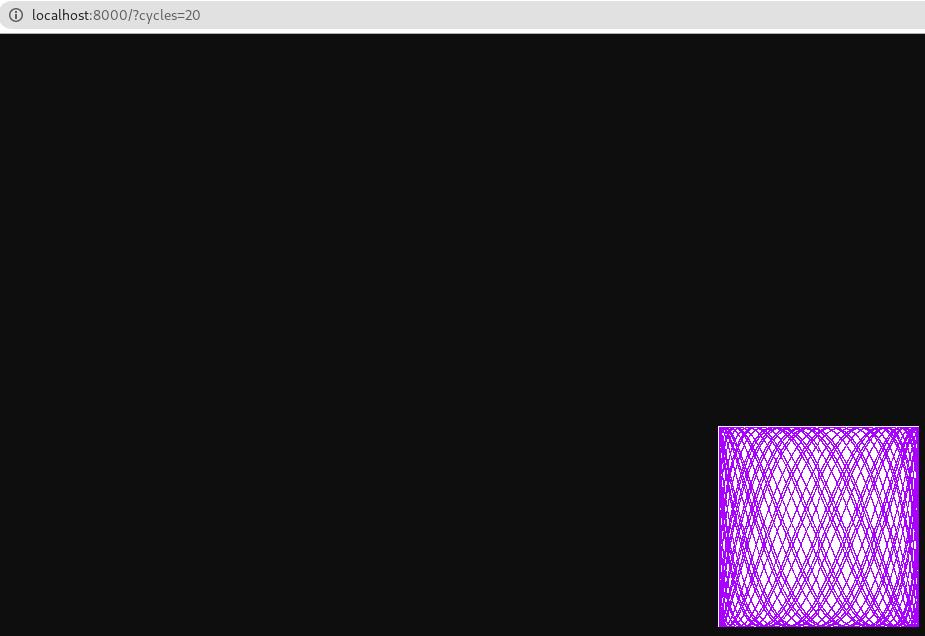

# 1 Tutorial
## 1.1
> Target
- Also print os.Args[0].

> Code
```go
package main

import (
	"fmt"
	"os"
)

func main() {
	for _, v := range os.Args[:] {
		fmt.Println(v)
		// Args[0]:代表着执行命令本身的名字
	}
}
```
> Run & Result
```bash
➜  E1 (master) ✗ go run . c1 c2 c3
/tmp/go-build4220552769/b001/exe/E1
c1
c2
c3
```
## 1.2
> Target
- Print the `index & value` of each of its arguments.

> Code
```go
package main

import (
	"fmt"
	"os"
)

func main() {
	for i, arg := range os.Args[1:] {
		fmt.Println(i+1, arg)
	}
}
```

> Run & Result
```bash
➜  E2 (master) ✗ go run . c1 c2 c3
1 c1
2 c2
3 c3
```

## 1.4
> Target
- Print the names of all files in which each duplicated line occurs.

> Code
```go
package main

import (
	"bufio"
	"fmt"
	"log"
	"os"
)

func main() {
	counts := make(map[string]int)
	files := os.Args[1:]

	// 如果没有加文件，就退出并提示
	if len(files) == 0 {
		log.Fatalf("\nError: 至少需要一个文件!\nExample: $ go run . <file name> <file name>...")
	}

	// 如果有就处理
	for _, arg := range files {
		f, err := os.Open(arg)
		if err != nil {
			fmt.Fprintf(os.Stderr, "dup2: %v\n", err)
			continue
		}
		countLines(f, counts, arg)
		f.Close()
	}
}

func countLines(f *os.File, counts map[string]int, arg string) {
	input := bufio.NewScanner(f)
	for input.Scan() {
		tmp := input.Text()
		counts[tmp]++
		if counts[tmp] > 1 {
			fmt.Printf("内容:%s, 所在文件:%s, 次数:%d\n", input.Text(), arg, counts[tmp])
		}
	}
}
```

> Run & Result
```bash
➜  E4 (master) ✗ go run . test1 test2
内容:a, 所在文件:test1, 次数:2
内容:2, 所在文件:test1, 次数:2
内容:2, 所在文件:test1, 次数:3
内容:4, 所在文件:test1, 次数:2
内容:aaa, 所在文件:test2, 次数:2
内容:1, 所在文件:test2, 次数:2
```

> Download Files
- [test1](../_files/ch1/test1 ':ignore')
- [test2](../_files/ch1/test2 ':ignore')

## 1.5 - 1.6
> Target
- Add some <font color="red">c</font><font color="green">o</font><font color="purple">l</font><font color="pink">o</font><font color="blue">r</font><font color="gray">s</font>

> Code
```go
package main

import (
	"image"
	"image/color"
	"image/gif"
	"io"
	"math"
	"math/rand"
	"os"
)

// struct slice
var palette = []color.Color{
	color.White,
	color.Black,
	// 添加了绿色和紫色
	color.RGBA{0x00, 0xFF, 0x00, 0xFF},
	color.RGBA{0xAA, 0x00, 0xFF, 0xFF},
}

const (
	// 语法糖：第一个为0,后面依次加1
	whiteIdx = iota
	blackIdx
	greenIdx
	purpleIdx
)

func main() {
	lissa(os.Stdout)
}

func lissa(out io.Writer) {
	const (
		cycles  = 5
		res     = 0.001
		size    = 100
		nframes = 64
		delay   = 9
	)

	freq := rand.Float64() * 3.0
	anim := gif.GIF{LoopCount: nframes}
	phase := 0.0

	for i := 0; i < nframes; i++ {
		rect := image.Rect(0, 0, 2*size+1, 2*size+1)
		img := image.NewPaletted(rect, palette)

		for t := 0.0; t < cycles*2*math.Pi; t += res {
			x := math.Sin(t)
			y := math.Sin(t*freq + phase)

			// 修改第三个参数来更改线条颜色
			img.SetColorIndex(size+int(x*size+0.5), size+int(y*size+0.5), purpleIdx)
		}

		phase += 0.1
		anim.Delay = append(anim.Delay, delay)
		anim.Image = append(anim.Image, img)
	}
	gif.EncodeAll(out, &anim)
}
```

> Run & Result
- 分别更换参数，执行了三次. 
- `> file name` 将结果输出到file里
```bash
➜  lissa (master) ✗ go run . > black.gif
➜  lissa (master) ✗ go run . > green.gif
➜  lissa (master) ✗ go run . > purple.gif
```


## 1.7 - 1.9
> Target
- Use `io.Copy(dst, src)` instead of `ioutil.ReadAll` & Check the error.
- Add the prefix `http://` to each argument URL if it's missing.
- Modify fetch to also print the HTTP `status code`.

> Code  
```go
package main

import (
	"fmt"
	"io"
	"log"
	"net/http"
	"os"
	"strings"
)

func main() {
	// E1.8 检测有没有前缀，如果没有，加上
	s, preS := os.Args[1], "http://"
	if !strings.HasPrefix(s, preS) {
		s = preS + s
	}

	resp, err := http.Get(s)
	if err != nil {
		log.Fatalln(err)
	}

	defer resp.Body.Close()

	// E1.9
	fmt.Println(resp.Status)

	// E1.7
	_, err = io.Copy(os.Stdout, resp.Body)
	if err != nil {
		log.Fatalln(err)
	}
}
```

> Run & Result
```bash
➜  E(789) (master) ✗ go run . baidu.com
200 OK
<html>
<meta http-equiv="refresh" content="0;url=http://www.baidu.com/">
</html>
```

## 1.10
> Target
- 找一个有大量数据产生的一个网站。
- 执行fetchall两次，看执行时间有无差距巨大? 得到的内容是一样的吗？
- 修改程序使输出到文件，然后对比两者是否一样？

> Code
```go
// Fetchall URLs in parallel & Reports their times and sizes.
package main

import (
	"fmt"
	"io"
	"log"
	"net/http"
	"os"
	"time"
)

func main() {
	start := time.Now()
	ch := make(chan string)
	urlList := []string{"https://www.bilibili.com"}

	for _, url := range urlList {
		go fetch(url, ch) // start a goroutine
	}

	for range urlList {
		fmt.Println(<-ch) // Receive from ch
	}

	fmt.Printf("%.2fs elapsed\n", time.Since(start).Seconds())
}

func fetch(url string, ch chan<- string) {
	start := time.Now()
	resp, err := http.Get(url)
	if err != nil {
		ch <- fmt.Sprint(err) // err send to ch
		return
	}
	defer resp.Body.Close()

	// E1.10 将结果存于运行命令的第一个参数（文件名）里
	file, err := os.Create(os.Args[1])
	if err != nil {
		log.Fatalln(err)
	}
	defer file.Close()

	nbytes, err := io.Copy(file, resp.Body)
	if err != nil {
		ch <- fmt.Sprintf("while reading %s: %v", url, err)
		return
	}

	secs := time.Since(start).Seconds()
	ch <- fmt.Sprintf("%.2fs %7d %s", secs, nbytes, url)
}
```

> Run & Result
```bash
➜  fetchall (master) ✗ go run . fetchBiliResult2.txt
1.10s   99840 https://www.bilibili.com
1.10s elapsed
➜  fetchall (master) ✗ go run . fetchBiliResult1.txt
0.48s  100498 https://www.bilibili.com
0.48s elapsed
```

> Declare
- 也不知道找哪个网站，就随便找了个bilibili首页
- 结果是：内容变化很小，但有变化。时间差距也不大。
- 缺陷：这个测试没有意义，毕竟这个website首页并不是产生大量数据的网页。

## 1.12
> Target
- 使其能够解析`cycles`等于几，然后将其作为`lissa`函数的参数。
- 两点：1.如何解析 2.string转int

> Code
```go
...

func main() {
	handler := func(w http.ResponseWriter, r *http.Request) {
		tmp := r.URL.RawQuery          // 获取？后面的内容,
		res := strings.Split(tmp, "=") // 拆分，返回一个切片
		if len(res) == 2 {
			cycles, _ := strconv.Atoi(res[1])
			lissa(w, cycles)
		} else {
			fmt.Fprint(w, "请补全参数. Example. localhost:8000/?cycles=[number]")
		}

	}
	http.HandleFunc("/", handler)
	http.ListenAndServe("localhost:8000", nil)
}
...
		// lissa函数中：将cycles 值转为f64
		for t := 0.0; t < float64(cycles)*2*Pi; t += res {
```

> Run & Result
```bash
➜  lissa (master) ✗ go run . &
```
<center>
 

</center>

